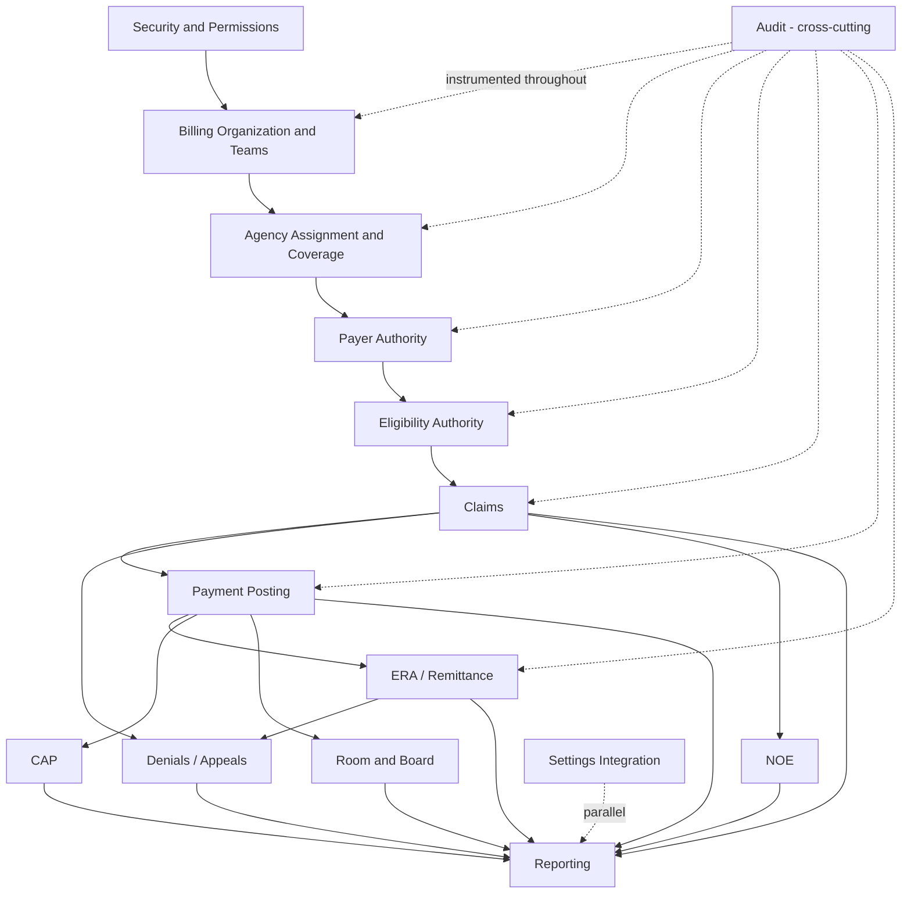

# Implementation Plan

## Status

**PLANNING ONLY.** This document defines the implementation roadmap —
sequence, dependencies, milestones, releases, validation checkpoints,
rollback/repair checkpoints, and acceptance gates. **No schema. No
migrations. No code. No API. No UI.** Implementation Planning is
authorized; implementation itself remains blocked pending a separate
Implementation Authorization Review.

## Inputs

This roadmap is derived from, and does not reopen, the following
approved documents:

- `FINAL_SCHEMA_AUTHORIZATION_REVIEW.md` — locked authority decisions.
- `TENANT_BILLER_OWNERSHIP_BOUNDARIES.md` — ownership/write-authority.
- `BILLING_SCHEMA_DESIGN_REVIEW.md` — per-structure REUSE/EXTEND
  decisions.
- `BILLING_MIGRATION_DESIGN_REVIEW.md` — future migration shapes.
- `LEGACY_BILLING_SCHEMA_INVENTORY.md` — verified record counts and
  consumer evidence.

---

## 1. Implementation Sequence

Ordered by dependency, not by business priority. Each numbered group
must be functionally stable before the next group begins.

1. **Foundation / Security** — Security & Permissions
   (`BillingProviderAgencyServiceScope`, role checks), because every
   later epic's acceptance criteria depend on permission enforcement
   already being correct.
2. **Billing Organization & Teams** —
   `BillingProviderOrganization`, `BillingProviderOrganizationMembership`
   — the provider-identity root every assignment depends on.
3. **Agency Assignment & Coverage** —
   `BillingProviderAgencyAssignment` (Option B write-authority
   delegation), `BillingProviderAgencyServiceScope` — depends on (2).
4. **Payer Authority** — `Payer`, `PatientPayer` (financial/billing
   authority) — depends on (2)/(3) only for provider-scoping context,
   not a hard dependency otherwise.
5. **Eligibility Authority** — `PatientInsurance`,
   `PayerEligibilityCheck`, `EligibilityVerification` — depends on (4)
   for payer-identity context.
6. **Claims** — `Claim`, `claim_edi_batches` — depends on (4) and (5)
   (payer/subscriber block, eligibility gating).
7. **Payment Posting** — `Payment`, `payment_adjustments` — depends on
   (6).
8. **ERA / Remittance** — `RemittanceAdvice` — depends on (7).
9. **Denials / Appeals** — depends on (6)/(7)/(8).
10. **NOE** — `NoeEdiSubmission` — depends on (6).
11. **CAP** — `HospiceCapRecord` — depends on (7).
12. **Room & Board** — facility payment expectation/allocation/alert/
    audit-log group — depends on (7).
13. **Audit** — cross-cutting; instrumented incrementally alongside
    (1)–(12), not as a single terminal phase.
14. **Reporting** — depends on (6)–(12) having stable data.
15. **Settings Integration** — terminology/labels (e.g., "Medicare
    Part A Hospice") — can proceed in parallel with any group once its
    consuming screens exist.

### 1.1 Dependency Order (summary graph)

### 1.2 Milestone Order

- **Milestone 1 — Foundation Ready:** Security/Permissions + Billing
  Organization/Teams + Agency Assignment/Coverage stories accepted.
- **Milestone 2 — Coverage Ready:** Payer Authority + Eligibility
  Authority stories accepted (includes the approved `PatientInsurance`
  ↔ `PatientPayer` link, per Final Schema Authorization Review §1).
- **Milestone 3 — Revenue Cycle Core Ready:** Claims + Payment Posting
  + ERA/Remittance stories accepted.
- **Milestone 4 — Exceptions Ready:** Denials/Appeals + NOE + CAP
  stories accepted.
- **Milestone 5 — Facility Financials Ready:** Room & Board stories
  accepted.
- **Milestone 6 — Visibility Ready:** Audit + Reporting + Settings
  Integration stories accepted.

### 1.3 Release Order

Each milestone is a release candidate gate, not necessarily a
production release; actual release cadence is a business decision
outside this document's scope. Recommended internal release order
mirrors the milestone order above (1 → 6), since each milestone's
acceptance gate depends on the previous milestone's data being
present and correct.

### 1.4 Validation Checkpoints

- End of Milestone 1: permission-enforcement and organization/
  assignment CRUD validated against `TENANT_BILLER_OWNERSHIP_
  BOUNDARIES.md`'s write-authority matrix.
- End of Milestone 2: `PatientInsurance`/`PatientPayer` link validated
  against Final Schema Authorization Review §1 (no consolidation, no
  `PatientCoverage`).
- End of Milestone 3: claim/payment/remittance data validated against
  `LEGACY_BILLING_SCHEMA_INVENTORY.md` verified consumer list (no
  consumer broken).
- End of Milestone 4: denial/appeal/NOE/CAP data validated against the
  same consumer list.
- End of Milestone 5: facility payment group validated end-to-end
  (expectation → allocation → alert → audit log).
- End of Milestone 6: audit/reporting/settings validated for
  completeness and correct terminology (per
  `BILLING_PLATFORM_SETTINGS_TERMINOLOGY` decision — "Medicare Part A
  Hospice" label).

### 1.5 Rollback / Repair Checkpoints

- Each milestone's forward-only migrations (when a future,
  separately-authorized Migration phase authors them) must have a
  documented rollback path before that milestone is marked accepted.
- Any milestone found to violate a locked architecture rule (e.g., an
  unauthorized `PatientCoverage` model) triggers an immediate halt and
  roll-forward repair, never a destructive rollback of already-shipped
  unrelated data.
- Repair checkpoints occur at the end of each milestone, not
  mid-milestone, to avoid partially-applied states.

### 1.6 Acceptance Gates

A milestone may not be marked complete until:

- All of its epics' stories (see `IMPLEMENTATION_STORIES.md`) are
  accepted.
- All of its domain entries (see `DOMAIN_IMPLEMENTATION_ORDER.md`)
  have a documented reuse/extension strategy.
- Its data-preservation checklist (see `DATA_PRESERVATION_PLAN.md`) is
  satisfied.
- Its validation checklist (see `IMPLEMENTATION_VALIDATION_PLAN.md`)
  is satisfied.
- Its test-strategy checklist (see `IMPLEMENTATION_TEST_STRATEGY.md`)
  is satisfied.

## Status Summary

Implementation Roadmap: **DRAFTED, PENDING APPROVAL.**

**IMPLEMENTATION REMAINS BLOCKED.** No schema, migration, code, API,
or UI work has been performed or is authorized by this document.
