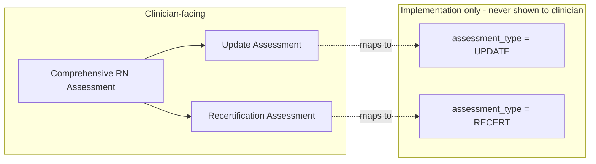
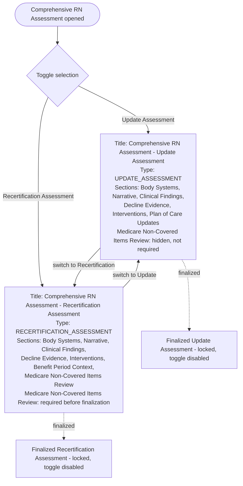

# SNS Update Assessment vs Recertification Assessment Requirement

**Requirement ID:** SNS-ASSESSMENT-TYPE-001
**Status:** Approved product workflow requirement, pending repository lifecycle mapping
**Priority:** Critical
**Applies to:** Comprehensive RN assessments, Body Systems, benefit-period workflows, recertification, QA, signatures, corrections, and audit history.
**Amended:** 2026-10-08 — Section 10 added (terminology correction). Original Sections 1-9 preserved unmodified below.

## 1. Requirement statement

SNS shall treat `Update Assessment` and `Recertification Assessment` as distinct assessment contexts, even when the user interface presents them through a toggle or shared comprehensive-assessment shell.

The toggle must select the assessment purpose and must not merely change the label of the same undifferentiated record.

## 2. Assessment contexts

### Initial Comprehensive RN Assessment

- Created for the initial comprehensive assessment within the applicable admission/election context.
- Must not be recreated without an approved new admission, readmission, or other explicitly authorized lifecycle event.
- A patient must not be able to accumulate unlimited initial comprehensive assessments within the same admission context.
- Body Systems and other assessment sections belong to this assessment instance.

### Update Assessment

- Used to update the comprehensive clinical picture because of routine reassessment, condition change, plan-of-care review, or another authorized update trigger.
- Does not create a recertification merely because it updates comprehensive information.
- Must identify the update trigger and relationship to the prior assessment.
- Must preserve the prior finalized assessment as historical evidence.

### Recertification Assessment

- Used for benefit-period recertification support.
- Must be linked to the applicable benefit period and recertification episode.
- Must capture the current clinical findings required to support recertification.
- Must include the required Medicare non-covered-items review defined in `SNS_MEDICARE_NON_COVERED_ITEMS_RECERTIFICATION_REQUIREMENT.md`.
- Must not be treated as an ordinary update assessment.

## 3. Toggle behavior

The shared UI may display:

- `Update`
- `Recertification`

The user must select one purpose before completing the assessment when the purpose is not predetermined by context.

The toggle shall control:

- Assessment type
- Required fields
- Validation rules
- Benefit-period relationship
- Recertification-specific sections
- Non-covered-items review
- Signature and finalization requirements
- QA routing
- Reports and exports
- Audit event type

The toggle shall not:

- Mutate a finalized Update Assessment into a Recertification Assessment.
- Mutate a finalized Recertification Assessment into an Update Assessment.
- Allow a user to bypass recertification requirements by selecting Update.
- Allow an ordinary update to create a new benefit period.
- Duplicate the Initial Comprehensive RN Assessment.

## 4. Lifecycle rules

```text
Admission / Election Context
  -> Initial Comprehensive RN Assessment, controlled creation
  -> Zero or more Update Assessments
  -> Zero or more Recertification Assessments, each linked to an applicable benefit period
```

Each assessment instance must have:

- Stable identifier
- Patient and tenant context
- Admission/election context
- Assessment type
- Trigger or reason
- Benefit-period link when recertification
- Author
- Draft status
- Finalization and authentication status
- QA status, separate from clinical status
- Correction/amendment/addendum relationships
- Created, updated, finalized, and signed timestamps
- Audit history

## 5. Body Systems ownership

Body Systems shall belong to an assessment instance, not directly to the patient without context.

Required ownership:

```text
Patient
  -> Admission / Election
    -> Assessment Instance
      -> Body Systems
```

This prevents the same Body Systems data from being ambiguously reused across Initial, Update, and Recertification assessments.

Historical Body Systems data may be displayed for comparison, but it shall remain attributable to its original assessment and shall not automatically become current documentation.

## 6. Clinical and QA status separation

Assessment purpose is separate from clinical record status and QA review status.

### Assessment purpose

- Initial Comprehensive
- Update
- Recertification

### Clinical record status

- Draft
- Finalized
- Signed / Authenticated
- Corrected
- Amended
- Addendum Added

### QA review status

- Pending QA Review
- QA Follow-Up Required
- QA Reviewed
- QA Approved

No one status dimension may overwrite another.

## 7. Acceptance criteria

1. An Initial Comprehensive RN Assessment cannot be created repeatedly within the same admission/election context without an explicitly authorized lifecycle event.
2. Update and Recertification create records with distinct assessment-type values.
3. A finalized assessment type cannot be changed by toggling the UI.
4. Recertification requires a benefit-period relationship.
5. Update does not create or advance a benefit period.
6. Recertification includes recertification-specific validation and the Medicare non-covered-items review.
7. Body Systems records are linked to the owning assessment instance.
8. Historical Body Systems data remains read-only and source-attributed when shown for comparison.
9. Clinical record status remains distinct from QA review status.
10. Authorization controls who may create, edit, finalize, sign, correct, amend, or QA-review each assessment.
11. Audit history records the selected assessment purpose and all authorized lifecycle transitions.
12. Tests verify that the toggle changes workflow requirements, not merely the visible label.

## 8. Repository validation required

Before implementation, GitHub shall locate all existing assessment, visit, certification, recertification, benefit-period, RNICA, Body Systems, signature, QA, and audit lifecycle models in every active worktree. Existing authoritative lifecycle mechanisms must be updated rather than duplicated.

## 9. Regulatory mapping note

This is an SNS product requirement. Exact timing, certification, recertification, signature, and benefit-period rules must be mapped to current controlling federal, California, payer, and SNS policy authorities before production implementation.

## 10. Terminology correction amendment (2026-10-08)

### 10.1 Correction

`RNICA` and `RNICA_UPDATE_TYPE` are implementation terminology only and must not appear in clinician-facing document names, titles, navigation, reports, or exports.

Clinician-facing product terminology:

- Document family name: **Comprehensive RN Assessment**
- Toggle option 1: **Update Assessment**
- Toggle option 2: **Recertification Assessment**

### 10.2 Toggle effects (clinician-facing)

| Effect | Update Assessment | Recertification Assessment |
|---|---|---|
| Title | Comprehensive RN Assessment (Update Assessment) | Comprehensive RN Assessment (Recertification Assessment) |
| Document type | `UPDATE_ASSESSMENT` | `RECERTIFICATION_ASSESSMENT` |
| Required sections | Body Systems, Narrative, Clinical Findings, Decline Evidence, Interventions, Plan of Care Updates | Body Systems, Narrative, Clinical Findings, Decline Evidence, Interventions, Benefit Period Context, Medicare Non-Covered Items Review |
| Medicare Non-Covered Items Review | Not displayed, not required | Displayed, required before finalization |
| Recert/benefit-period validations | Inactive | Active |

Switching Update -> Recertification must change title, document type, activate recert + benefit-period validation, and display the Medicare Non-Covered Items Review. Switching Recertification -> Update must reverse all of the above. This is a UI/workflow-state requirement only; no code change is authorized by this amendment.

### 10.3 Repository validation — can existing values be mapped without exposing RNICA?

**Backend `assessment_type` stored values** (`backend/app/api/visits.py:109-111`): `RNICA_ADMISSION_TYPE = "RNICA"`, `RNICA_UPDATE_TYPE = "UPDATE"`, `RNICA_RECERT_TYPE = "RECERT"`. Only the *constant names* contain "RNICA" — the **stored/persisted values for Update (`"UPDATE"`) and Recertification (`"RECERT"`) do not contain the string "RNICA"**. These two values can be mapped 1:1 to `UPDATE_ASSESSMENT` / `RECERTIFICATION_ASSESSMENT` as clinician-facing document-type labels without any data migration. The Initial type's stored value is literally `"RNICA"`; that value is internal to this analysis and is not addressed by this amendment (Initial Comprehensive is out of scope of the Update/Recert toggle).

**Frontend label mapping already exists and is already clean for history display** (`sns-emr-frontend/src/charts/PatientChart.jsx:476-483`): `assessment_type === 'UPDATE'` -> `"RN Update"` / `"RN Update - HUV1"` / `"RN Update - HUV2"`; `assessment_type === 'RECERT'` -> `"RN Re-Cert"`. Neither label contains "RNICA." This confirms the underlying data can support the requirement today.

**Confirmed existing gap — "RNICA" still leaks into clinician-facing UI chrome independent of assessment_type.** Found literal "RNICA" text rendered regardless of which assessment type is open: `RnicaWorkflowRail.jsx:103,149` (`"RNICA Workflow"`), `RNICACommandWorkspace.jsx:235` (`"RNICA"` eyebrow), `RnicaDesignSystem.jsx:82` (`"RNICA Intelligence"` default AI-advisory title), `PatientStoryShadcn.jsx:190` (`"RNICA Intelligence"`), `PatientChart.jsx:477` (`"RNICA Admission"` label for the Initial type). These are module-shell/navigation-level strings, not assessment-type-derived labels, so they are not fixed merely by using the correct `assessment_type` value — they require separate UI copy changes. **Classification: NOT VERIFIED as compliant today; confirmed, located gap.**

**Conclusion:** mapping existing `assessment_type` values (`UPDATE`, `RECERT`) to the required clinician-facing document types (`UPDATE_ASSESSMENT`, `RECERTIFICATION_ASSESSMENT`) is feasible without a data migration. Eliminating "RNICA" from clinician-visible surfaces is a separate, already-located UI-copy gap in the module shell/navigation components listed above, not a data-model gap. No implementation is authorized by this amendment.

### 10.4 Revised workflow diagrams

Clinician-facing vs. implementation terminology:



Toggle effect on document state:


